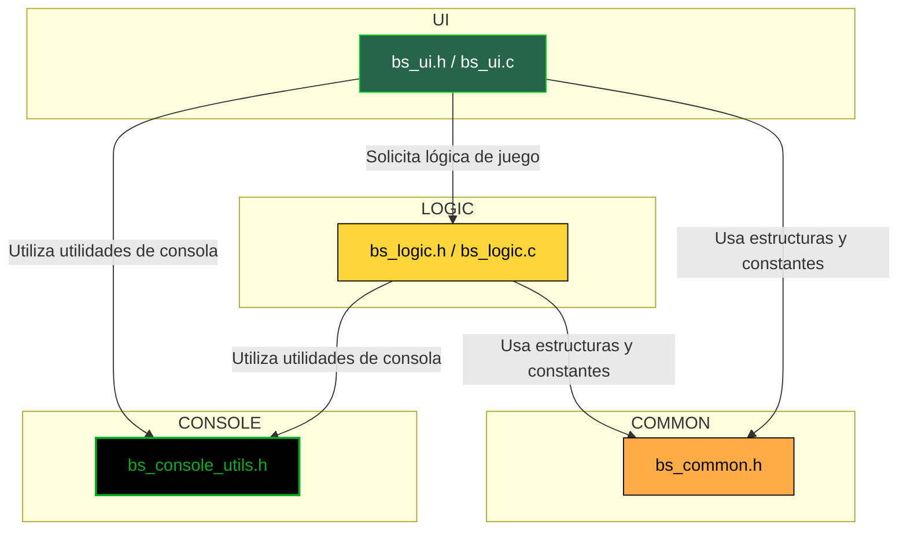

# Índice de Bibliotecas del Proyecto Batalla Naval

Bienvenido a la documentación técnica de las bibliotecas utilizadas en el proyecto **Batalla Naval**. Aquí encontrarás una descripción resumida de cada módulo, su propósito, justificación de uso y un diagrama de flujo de datos que ilustra cómo interactúan entre sí.

---

## Índice

- [bs_common.h](#bs_commonh)
- [bs_console_utils.h](#bs_console_utilsh)
- [bs_logic.h / bs_logic.c](#bs_logich--bs_logicc)
- [bs_ui.h / bs_ui.c](#bs_uih--bs_uic)

---

### [``bs_common.h``](../../codigo_fuente/bs_common.h)

**Propósito:**  
Define las estructuras y constantes fundamentales compartidas por todo el proyecto, como el tamaño del tablero, los tipos de barcos, jugadores y cartas.

**Justificación:**  
Centraliza las definiciones para evitar duplicidad y facilitar el mantenimiento del código.

**Enlace a documentación específica:**  
[Ver documentación de bs_common.h](./Common.md)

---

### [``bs_console_utils.h``](../../codigo_fuente/bs_console_utils.h)

**Propósito:**  
Proporciona utilidades para la manipulación de la consola, como limpiar pantalla y cambiar colores de texto.

**Justificación:**  
Permite una experiencia de usuario más amigable y profesional, facilitando la visualización de información relevante y errores.

**Enlace a documentación específica:**  
[Ver documentación de bs_console_utils.h](./Console_utils.md)

---

### [``bs_logic.h``](../../codigo_fuente/bs_logic.h) / [``bs_logic.c``](../../codigo_fuente/bs_logic.c)

**Propósito:**  
Contiene la lógica principal del juego: inicialización de jugadores y barcos, validaciones, procesamiento de coordenadas y gestión de memoria.

**Justificación:**  
Separa la lógica del juego de la interfaz, promoviendo modularidad y facilidad de pruebas.

**Enlace a documentación específica:**  
[Ver documentación de bs_logic](./Logic.md)

---

### [``bs_ui.h``](../../codigo_fuente/bs_ui.h) / [``bs_ui.c``](../../codigo_fuente/bs_ui.c)

**Propósito:**  
Gestiona la interacción con el usuario: menús, impresión de tableros, solicitud de datos y flujo de la partida.

**Justificación:**  
Aísla la presentación y entrada/salida del usuario de la lógica del juego, facilitando cambios en la interfaz sin afectar el núcleo.

**Enlace a documentación específica:**  
[Ver documentación de bs_ui](./UI.md)

---

### Diagrama de Flujo de Datos entre Bibliotecas

---

### Resumen de Interacciones

- **bs_ui** es el punto de entrada para el usuario y orquesta la interacción con el resto de módulos.
- **bs_logic** implementa las reglas y validaciones del juego, siendo invocado por la UI.
- **bs_common** provee las definiciones de datos y constantes a todos los módulos.
- **bs_console_utils** es utilizado tanto por la UI como por la lógica para mejorar la experiencia visual en consola.

---

> Consulta la documentación específica de cada biblioteca para detalles de implementación y ejemplos de uso.  
> _¡Haz clic en los enlaces del índice para acceder rápidamente!_
