## Documentación Técnica de la Biblioteca [`bs_logic.h`] / [`bs_logic.c`]

La biblioteca [`bs_logic.h`] / [`bs_logic.c`] constituye el núcleo de la lógica del juego "Batalla Naval", gestionando la inicialización de jugadores y barcos, validaciones de reglas, manipulación de memoria dinámica y utilidades de control de flujo. A continuación, se detalla el propósito, funcionamiento y relaciones de cada función, así como las dependencias externas y un diagrama de flujo de interacción.

---

### Bibliotecas Incluidas

```c
#include <stdio.h>
#include <stdlib.h>
#include <math.h>
#include <stdbool.h>
#include "bs_common.h"
#include "bs_console_utils.h"
#include "bs_ui.h"
```
- **`stdio.h` y `stdlib.h`**: Para operaciones estándar de entrada/salida y utilidades generales.
- **`stdbool.h`**: Uso de tipos booleanos.
- **`math.h`**: Provee funciones estándar de operaciones matemáticas.
- [`bs_common.h`]: Define estructuras y constantes compartidas (jugadores, barcos, tablero).
- [`bs_console_utils.h`]: Utilidades para manipulación de consola (colores, limpieza de pantalla).
- [`bs_ui.h`]: Funciones de interfaz de usuario (solicitud de nombre, mensajes, interacción visual).

---

### Funciones Principales

#### 1. [`void inicializar_barco(struct ship *barco, int size);`]

**Propósito:**   
Reserva memoria dinámica para el arreglo [`status`] del barco, inicializa su tamaño y estados.

**Código relevante:**
```c
void inicializar_barco(struct ship *barco, int size) {
    barco-> size = size;
    barco->orientation = 'U'; // No definido
    barco->direction = 'U'; // No definido

    // Reservar memoria para el estado del barco.
    barco->status = (int **)malloc(size * sizeof(int *));
    for (int i = 0; i < size; i++) {
        barco->status[i] = (int *)malloc(3 * sizeof(int)); // 3 columnas para x, y y estado
        barco->status[i][0] = -1; // Inicializar coordenadas x a -1
        barco->status[i][1] = -1; // Inicializar coordenadas y a -1
        barco->status[i][2] = 0; // Inicializar estado a 0 (agua)
    }
}
```
**Variables:**   
  - [`barco->size`]: Tamaño del barco.
  - [`barco->orientation`], [`barco->direction`]: Inicializados como 'U' (indefinido).
  - [`barco->status`]: Matriz dinámica `[size][3]` para coordenadas y estado de cada segmento del barco.

**Dependencias:**   
`malloc` para memoria dinámica.

---

#### 2. [`void inicializar_jugador(struct player *player);`]

**Propósito:**   
Solicita el nombre del jugador, inicializa contadores y flota.

**Codigo relevante:**   
```c
void inicializar_jugador(struct player *player) {

    // Asignar el nombre al jugador.
    solicitar_nombre(player->name, sizeof(player->name));

    // Inicializar estado de jugador.
    player->placed_ships = 0;
    player->sunked_enemy_ships = 0;
    player->sunked_ships = 0;

    // Inicializar barcos.
    inicializar_flota(player);
}
```
**Variables:**   
  - [`player->name`]: Nombre del jugador.
  - [`player->placed_ships`], [`player->sunked_enemy_ships`], [`player->sunked_ships`]: Contadores de estado.

**Bibliotecas llamadas:**   
- [`bs_ui.h`] para llamar a la funcion [`solicitar_nombre`]
- [`bs_logic.h`] para llamar a la funcion[`inicializar_flota`].

---

#### 3. [`void inicializar_flota(struct player *player);`]

**Propósito:**   
Inicializa los barcos de un jugador con tamaños estándar.

**Código relevante:**
```c
void inicializar_flota(struct player *player) {
    // Initialize ships with different sizes
    inicializar_barco(&player->ships[0], 5); // 5 cells
    inicializar_barco(&player->ships[1], 4); // 4 cells
    inicializar_barco(&player->ships[2], 3); // 3 cells
    inicializar_barco(&player->ships[3], 3); // 3 cells
    inicializar_barco(&player->ships[4], 2); // 2 cells
}
```
**Variables**:
  - [`player->ships[]`](../../codigo_fuente/bs_common.h#L26): Arreglo de barcos con tamaños 5, 4, 3, 3, 2.

---

#### 4. Validaciones de Coordenadas y Reglas

##### 4.1 [`bool validar_coordenadas_en_rango(int fila, int columna);`]

**Propósito:**   
Verifica que las coordenadas estén dentro del tablero.

**Código relevante:**
```c
bool validar_coordenadas_en_rango(int fila, int columna) {
    return (fila >= 0 && fila < BOARD_SIZE && columna >= 0 && columna < BOARD_SIZE);
}
```

##### 4.2 [`bool validar_orientacion(int filaInicio, int filaFin, int columnaInicio, int columnaFin);`]

**Propósito:**   
Asegura que el barco sea colocado en línea recta (horizontal o vertical).

**Código relevante:**
```c
bool validar_orientacion(int filaInicio, int filaFin, int columnaInicio, int columnaFin) {
    return (filaInicio == filaFin || columnaInicio == columnaFin);
}
```

##### 4.3 [`bool validar_dimension(int filaInicio, int filaFin, int columnaInicio, int columnaFin, int dimension_reuqerida);`]

**Propósito:**   
Verifica que el barco ocupe exactamente el número de celdas requeridas.

**Código relevante:**
```c
bool validar_dimension(int filaInicio, int filaFin, int columnaInicio, int columnaFin, int dimension_reuqerida) {
    int dimension_actual;

    if (filaInicio == filaFin) {
        dimension_actual = abs(columnaFin - columnaInicio) + 1;
    } else if(columnaInicio == columnaFin) {
        dimension_actual = abs(filaFin - filaInicio) + 1;
    } else {
        return false; // No es una línea recta
    }
    
    return (dimension_actual == dimension_reuqerida);
    
}
```

##### 4.4 [`bool validar_solapamiento(int matriz[BOARD_SIZE][BOARD_SIZE], int filaInicio, int filaFin, int columnaInicio, int columnaFin, struct ship *ship_i);`](../../codigo_fuente/bs_logic.c#L69)

**Propósito:**   
Comprueba que no haya barcos superpuestos en el tablero.

**Código relevante:**
```c
bool validar_solapamiento(int matriz[BOARD_SIZE][BOARD_SIZE], int filaInicio, int filaFin, int columnaInicio, int columnaFin, struct ship *ship_i) {
    int i;

    // Determinar la orientación y dirección del barco
    if (filaInicio == filaFin) {
        ship_i->orientation = 'H'; // Horizontal
        if (columnaInicio <= columnaFin) {
            ship_i->direction = 'E'; // Este
            for (i = columnaInicio; i <= columnaFin; i++) {
                if (matriz[filaInicio][i] != 0) {
                    return false; // Hay solapamiento
                }
            }
        } else {
            ship_i->direction = 'O'; // Oeste
            for (i = columnaFin; i <= columnaInicio; i++) {
                if (matriz[filaInicio][i] != 0) {
                    return false; // Hay solapamiento
                }
            }
        }
    } else if (columnaInicio == columnaFin) {
        ship_i->orientation = 'V'; // Vertical
        if (filaInicio <= filaFin) {
            ship_i->direction = 'S'; // Sur
            for (i = filaInicio; i <= filaFin; i++) {
                if (matriz[i][columnaInicio] != 0) {
                    return false; // Hay solapamiento
                }
            }
        } else {
            ship_i->direction = 'N'; // Norte
            for (i = filaFin; i <= filaInicio; i++) {
                if (matriz[i][columnaInicio] != 0) {
                    return false; // Hay solapamiento
                }
            }
        }
    }
    return true; // No hay solapamiento
}
```

**Variables**:
- `matriz`: Tablero de juego.
- [`ship_i->orientation`], [`ship_i->direction`]: Se determinan aquí según la colocación.

---

#### 5. [`void colocar_barco_en_tablero(int matriz[BOARD_SIZE][BOARD_SIZE], struct ship *ship_i, int filaInicio, int filaFin, int columnaInicio, int columnaFin);`](../../codigo_fuente/bs_logic.c#L112)

**Propósito:**   
Marca en el tablero y en el estado del barco las posiciones ocupadas.

**Código relevante:**
```c
void colocar_barco_en_tablero(int matriz[BOARD_SIZE][BOARD_SIZE], struct ship *ship_i, int filaInicio, 
                              int filaFin, int columnaInicio, int columnaFin) {
    int i, idx = 0;

    // Guardar las coordenadas de inicio y fin del barco.
    if (ship_i->orientation == 'H') {
        if (ship_i->direction == 'E') {
            for (i = columnaInicio; i <= columnaFin; i++, idx ++) {
                if (idx == 0) {
                    matriz[filaInicio][i] = SHIP_STER; // se asigna el valor 1 para la popa del barco.
                } else {
                    matriz[filaInicio][i] = SHIP_BODY; // se asigna el valor 2 para el cuerpo del barco.
                }
                ship_i->status[idx][0] = filaInicio; // Guardar coordenadas x
                ship_i->status[idx][1] = i; // Guardar coordenadas y
                if (idx == 0) {
                    ship_i->status[idx][2] = SHIP_STER; // Estado de la punta del barco
                } else {
                    ship_i->status[idx][2] = SHIP_BODY; // Estado del cuerpo del barco
                }
            }
        } else if (ship_i->direction == 'O') {
            for (i = columnaInicio; i >= columnaFin; i--, idx++) {
                if (idx == 0) {
                    matriz[filaInicio][i] = SHIP_STER; // se asigna el valor 1 para la popa del barco.
                } else {
                    matriz[filaInicio][i] = SHIP_BODY; // se asigna el valor 2 para el cuerpo del barco.
                }
                ship_i->status[idx][0] = filaInicio; // Guardar coordenadas x
                ship_i->status[idx][1] = i; // Guardar coordenadas y
                if (idx == 0) {
                    ship_i->status[idx][2] = SHIP_STER; // Estado de la punta del barco
                } else {
                    ship_i->status[idx][2] = SHIP_BODY; // Estado del cuerpo del barco
                }  
            }
        }
    } else if (ship_i->orientation == 'V') {
        if (ship_i->direction == 'S') {
            for (i = filaInicio; i <= filaFin; i++, idx++) {
                if (idx == 0) {
                    matriz[i][columnaInicio] = SHIP_STER; // se asigna el valor 1 para la popa del barco.
                } else {
                    matriz[i][columnaInicio] = SHIP_BODY; // se asigna el valor 2 para el cuerpo del barco.
                }
                ship_i->status[idx][0] = i; // Guardar coordenadas x
                ship_i->status[idx][1] = columnaInicio; // Guardar coordenadas y
                if (idx == 0) {
                    ship_i->status[idx][2] = SHIP_STER; // Estado de la punta del barco
                } else {
                    ship_i->status[idx][2] = SHIP_BODY; // Estado del cuerpo del barco
                }
            }
        } else if (ship_i->direction == 'N') {
            for (i = filaInicio; i >= filaFin; i--, idx++) {
                if (idx == 0) {
                    matriz[i][columnaInicio] = SHIP_STER; // se asigna el valor 1 para la popa del barco.
                } else {
                    matriz[i][columnaInicio] = SHIP_BODY; // se asigna el valor 2 para el cuerpo del barco.
                }
                ship_i->status[idx][0] = i; // Guardar coordenadas x
                ship_i->status[idx][1] = columnaInicio; // Guardar coordenadas y
                if (idx == 0) {
                    ship_i->status[idx][2] = SHIP_STER; // Estado de la punta del barco
                } else {
                    ship_i->status[idx][2] = SHIP_BODY; // Estado del cuerpo del barco
                }
            }
        }
    }

}
```

**Variables:**
- `matriz`: Se actualiza con valores [`SHIP_STER`] y [`SHIP_BODY`].
- [`ship_i->status`]: Se actualizan coordenadas y estado de cada segmento.

---

#### 6. [`bool procesar_coordenadas(int matriz[BOARD_SIZE][BOARD_SIZE], struct ship *ship_i, int filaInicio, int filaFin, int columnaInicio, int columnaFin);`](../../codigo_fuente/bs_logic.c#L185)

**Propósito:**  
Orquesta todas las validaciones antes de colocar un barco.

**Código relevante:**
```c
bool procesar_coordenadas(int matriz[BOARD_SIZE][BOARD_SIZE], struct ship *ship_i, 
                          int filaInicio, int filaFin, int columnaInicio, int columnaFin) {
    // Validar orientación (horizontal o vertical)
    if(!validar_orientacion(filaInicio, filaFin, columnaInicio, columnaFin)) {
        color_txt(ERROR_COLOR);
        printf("Las coordenadas no son validas. El barco debe ser horizontal o vertical.\n");
        color_txt(DEFAULT_COLOR);
        return false;
    }

    // Validar que la dimensión del barco sea correcta
    if(!validar_dimension(filaInicio, filaFin, columnaInicio, columnaFin, ship_i->size)) {
        color_txt(ERROR_COLOR);
        printf("Las coordenadas no son validas. El barco debe tener exactamente %d celdas de longitud.\n", ship_i->size);
        color_txt(DEFAULT_COLOR);
        return false;
    }

    // Validar que no haya solapamiento con otros barcos
    if(!validar_solapamiento(matriz, filaInicio, filaFin, columnaInicio, columnaFin, ship_i)) {
        color_txt(ERROR_COLOR);
        printf("Las coordenadas no son validas. Hay solapamiento con otro barco.\n");
        color_txt(DEFAULT_COLOR);
        return false;
    }    
    return true;
}
```

**Flujo:**  
Llama a validaciones de orientación, dimensión y solapamiento.

---

#### 7. [`int decidir_primer_turno(const struct player *p1, const struct player *p2);`]

**Propósito:**  
Selecciona aleatoriamente qué jugador inicia.

**Código relevante:**
```c
int decidir_primer_turno(const struct player *p1, const struct player *p2) {
    int primer_turno = (rand() % 2) + 1;
    limpiar_pantalla();
    printf("El numero aleatorio para decidir quien inicia es:"); color_txt(INFO_COLOR); printf(" %d\n", primer_turno); color_txt(DEFAULT_COLOR);
    Sleep(1000);
    if (primer_turno == 1) {
        color_txt(INFO_COLOR); printf("¡%s ",p1->name); color_txt(DEFAULT_COLOR); printf(" ha sido elegido para comenzar la partida!\n");
    } else {
        color_txt(INFO_COLOR); printf("¡%s ",p2->name); color_txt(DEFAULT_COLOR); printf(" ha sido elegido para comenzar la partida!\n");
    }
    enter_continuar();
    getchar();
    return primer_turno;
}
```

**Dependencias:**  
`rand()`, funciones de UI para mostrar mensajes.

---

#### 8. Utilidades de Memoria

##### 8.1 [`void limpiar_buffer_entrada();`]

**Propósito:**  
Elimina caracteres residuales del buffer de entrada estándar.

**Código relevante:**
```c
void limpiar_buffer_entrada() {
    int c;
    while ((c = getchar()) != '\n' && c != EOF);
}
```

##### 8.2 [`void liberar_status(struct ship *barco);`]

**Propósito:**  
Libera la memoria dinámica de la matriz `status` de un barco.

**Código relevante:**
```c
void liberar_status(struct ship *barco) {
    for (int i = 0; i < barco->size; i++) {
        free(barco->status[i]);
    }
    free(barco->status);
    barco->status = NULL; // Evitar puntero colgante
}
```

##### 8.3 [`void liberar_flota(struct player *player);`]

**Propósito:**  
Libera la memoria de todos los barcos de un jugador.

**Código relevante:**
```c
void liberar_flota(struct player *player) {
    for (int i = 0; i < NUM_SHIPS; i++) {
        liberar_status(&player->ships[i]);
    }
}
```
---

### Diagrama de Flujo de Relaciones

```mermaid
flowchart TD
    subgraph EXTERNAS [Bibliotecas Externas]
        A1["<span style='color:#1E90FF'><b>bs_common.h</b></span><br><span style='color:#888'>(Estructuras y defines)</span>"]
        A2["<span style='color:#1E90FF'><b>bs_console_utils.h</b></span><br><span style='color:#888'>(Colores, limpiar_pantalla)</span>"]
        A3["<span style='color:#1E90FF'><b>bs_ui.h</b></span><br><span style='color:#888'>(UI, solicitar_nombre, enter_continuar)</span>"]
        A4["<span style='color:#1E90FF'><b>stdlib.h, stdio.h, math.h, stdbool.h</b></span>"]
    end

    subgraph LOGIC [<span style='color:#228B22'><b>bs_logic.c</b></span>]
        B1["<span style='color:#32CD32'><b>inicializar_jugador</b></span>"]
        B2["<span style='color:#32CD32'><b>inicializar_flota</b></span>"]
        B3["<span style='color:#32CD32'><b>inicializar_barco</b></span>"]
        B4["<span style='color:#32CD32'><b>procesar_coordenadas</b></span>"]
        B5["<span style='color:#32CD32'><b>validar_orientacion</b></span>"]
        B6["<span style='color:#32CD32'><b>validar_dimension</b></span>"]
        B7["<span style='color:#32CD32'><b>validar_solapamiento</b></span>"]
        B8["<span style='color:#32CD32'><b>colocar_barco_en_tablero</b></span>"]
        B9["<span style='color:#32CD32'><b>decidir_primer_turno</b></span>"]
        B10["<span style='color:#32CD32'><b>limpiar_buffer_entrada</b></span>"]
        B11["<span style='color:#32CD32'><b>liberar_status</b></span>"]
        B12["<span style='color:#32CD32'><b>liberar_flota</b></span>"]
    end

    %% Relaciones internas
    B1 --> B2
    B2 --> B3
    B4 --> B5
    B4 --> B6
    B4 --> B7
    B8 --> B3
    B12 --> B11

    %% Relaciones externas
    B1 --> A3
    B2 --> A1
    B3 --> A1
    B4 --> A1
    B4 --> A2
    B4 --> A3
    B5 --> A1
    B6 --> A1
    B7 --> A1
    B8 --> A1
    B9 --> A2
    B9 --> A3
    B10 --> A4
    B11 --> A4
    B12 --> A1

    %% Leyenda
    classDef ext fill:#e6f2ff,stroke:#1E90FF,stroke-width:2px;
    classDef logic fill:#eaffea,stroke:#228B22,stroke-width:2px;
    class A1,A2,A3,A4 ext;
    class B1,B2,B3,B4,B5,B6,B7,B8,B9,B10,B11,B12 logic;
```

- **Nodos violetas**: Bibliotecas externas de UI.
- **Nodos azules**: Utilidades de consola.
- **Flechas**: Llamadas directas de función o dependencia.

---

### Conclusión

La biblioteca [`bs_logic.h`] / [`bs_logic.c`] abstrae y centraliza la lógica de reglas y gestión de memoria del juego, asegurando integridad en la colocación de barcos, inicialización de jugadores y control de flujo. Su diseño modular permite una interacción clara con la interfaz de usuario y utilidades de consola, facilitando la mantenibilidad y escalabilidad del proyecto. Cada función está orientada a la robustez y claridad, delegando la interacción visual y de entrada/salida a las bibliotecas especializadas (bs_ui.h, bs_console_utils.h).

[`bs_logic.h`]: ../../codigo_fuente/bs_logic.h

[`bs_logic.c`]: ../../codigo_fuente/bs_logic.c

[`bs_ui.h`]: ../../codigo_fuente/bs_ui.h

[`bs_common.h`]: ../../codigo_fuente/bs_common.h

[`bs_console_utils.h`]: ../../codigo_fuente/bs_console_utils.h

[`void inicializar_barco(struct ship *barco, int size);`]: ../../codigo_fuente/bs_logic.c#L6

[`status`]: ../../codigo_fuente/bs_common.h#L20

[`barco->size`]: ../../codigo_fuente/bs_common.h#L17

[`barco->orientation`]: ../../codigo_fuente/bs_common.h#L18

[`barco->direction`]: ../../codigo_fuente/bs_common.h#L19

[`barco->status`]: ../../codigo_fuente/bs_common.h#L20

[`ship_i->size`]: ../../codigo_fuente/bs_common.h#L17

[`ship_i->orientation`]: ../../codigo_fuente/bs_common.h#L18

[`ship_i->direction`]: ../../codigo_fuente/bs_common.h#L19

[`ship_i->status`]: ../../codigo_fuente/bs_common.h#L20

[`void inicializar_jugador(struct player *player);`]: ../../codigo_fuente/bs_logic.c#L22

[`void inicializar_flota(struct player *player);`]: ../../codigo_fuente/bs_logic.c#L37

[`bool validar_coordenadas_en_rango(int fila, int columna);`]: ../../codigo_fuente/bs_logic.c#L46

[`bool validar_orientacion(int filaInicio, int filaFin, int columnaInicio, int columnaFin);`]: ../../codigo_fuente/bs_logic.c#L50

[`bool validar_dimension(int filaInicio, int filaFin, int columnaInicio, int columnaFin, int dimension_reuqerida);`]: ../../codigo_fuente/bs_logic.c#L54

[`int decidir_primer_turno(const struct player *p1, const struct player *p2);`]: ../../codigo_fuente/bs_logic.c#L213

[`void limpiar_buffer_entrada();`]: ../../codigo_fuente/bs_logic.c#L229

[`void liberar_status(struct ship *barco);`]: ../../codigo_fuente/bs_logic.c#L234

[`void liberar_flota(struct player *player);`]: ../../codigo_fuente/bs_logic.c#L242

[`player->name`]: ../../codigo_fuente/bs_common.h#L25
[`player->placed_ships`]: ../../codigo_fuente/bs_common.h#L27
[`player->sunked_enemy_ships`]: ../../codigo_fuente/bs_common.h#L28
[`player->sunked_ships`]: ../../codigo_fuente/bs_common.h#L29

[`SHIP_STER`]: ../../codigo_fuente/bs_common.h#L11
[`SHIP_BODY`]: ../../codigo_fuente/bs_common.h#L12