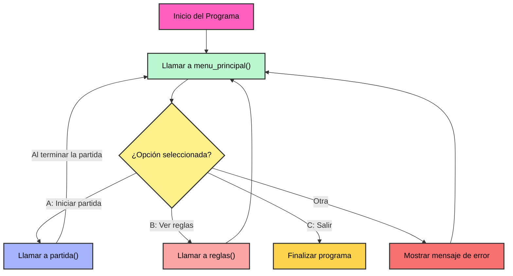

# Requisito Funcional 02: Menú Principal

## Introducción

El menú principal constituye el punto de entrada y el eje central de navegación del sistema Batalla Naval. Su propósito es proporcionar al usuario una interfaz intuitiva, estructurada y eficiente para acceder a las funcionalidades clave del juego, tales como iniciar una nueva partida, consultar las reglas e instrucciones, o finalizar la sesión.

El diseño del menú principal es fundamental para garantizar una experiencia de usuario óptima, ya que orienta la interacción, minimiza errores de navegación y facilita el acceso a cada módulo del sistema. Este menú se implementa como una función interactiva que se ejecuta automáticamente al inicio del programa y tras la conclusión de partidas o la consulta de reglas, asegurando así la continuidad operativa y la centralización del flujo de control.

La selección de opciones se realiza mediante la introducción de caracteres específicos, permitiendo una interacción ágil y sin ambigüedades. El menú permanece activo hasta que el usuario decide salir explícitamente, lo que contribuye a la robustez y seguridad del sistema. En resumen, el menú principal es un componente esencial que integra y articula todas las funcionalidades principales de Batalla Naval bajo un enfoque profesional y orientado a la usabilidad.

## Elementos del Menú Principal

Las siguientes opciones conforman la estructura fundamental del menú principal:

- **Iniciar partida:**  
  Al seleccionar esta opción, se ejecuta la función:

  ```c
    void partida();
  ```

  Esta acción inicia el proceso integral de registro de jugadores, la colocación estratégica de barcos y el desarrollo del ciclo principal del juego.  
  </br>

- **Ver reglas:**  
  Al seleccionar esta opción, se ejecuta la función:

  ```c
    void reglas();
  ```

  El sistema despliega de manera clara las reglas e instrucciones del juego, permitiendo al usuario consultarlas y regresar posteriormente al menú principal.  
  </br>

- **Salir:**  
  Esta opción finaliza el ciclo de ejecución de `menu_principal`, llevando al cierre controlado del programa y solicitando una última confirmación para cerrar la consola.  
  </br>

## Descripción de la función `menu_principal()`

La función `menu_principal()` es el núcleo operativo que gestiona la interacción del usuario con el sistema, permitiendo la navegación entre las distintas funcionalidades principales del juego. Su diseño garantiza un flujo de control claro, robusto y eficiente, asegurando la correcta validación de entradas y la ejecución de las acciones correspondientes según la opción seleccionada.

- **Variables utilizadas:**

    ```c
    void menu_principal() {
        char opc;
        bool loop = true;
        //codigo...
    }
    ```

  - `char opc;`  
    Variable que almacena el carácter introducido por el usuario, determinando la opción seleccionada en el menú principal.

  - `bool loop;`  
    Bandera de control que mantiene activo el ciclo principal de la función. Se inicializa en `true` y permite que el menú se muestre de manera continua hasta que el usuario decida salir.

- **Ciclo principal de la función:**

    ```c
        do {
            printf("Ingrese la opcion que desee realizar.\n");
            printf("Opciones:\n");
            printf("[A]: Iniciar partida\n");
            printf("[B]: Ver reglas.\n");
            printf("[C]: Salir\n");
            scanf(" %c", &opc);
            limpiar_buffer_entrada(); // Limpiar el buffer de entrada
            opc = toupper(opc); // Convertir a mayúscula para evitar problemas de comparación.
            if (opc == 'A' || opc == 'B' || opc == 'C') {
                limpiar_pantalla(); // Limpiar la pantalla antes de mostrar el menú.
            }
            switch(opc) {
                case 'A':
                    partida();
                    break;
                case 'B':
                    reglas();
                    break;
                case 'C':
                    printf("Gracias por haber usado el programa :)");
                    loop = false;
                    break;
                default:
                    puts("¡Tecla invalida!");
                    Sleep(1000);
                    limpiar_pantalla();
                    break;
            }
        } while(loop);
    ```

    El ciclo principal implementa un bucle do-while que asegura la persistencia del menú mientras la bandera `loop` permanezca activa. Tras cada entrada, el sistema valida la opción seleccionada, ejecutando la función correspondiente o notificando al usuario en caso de entrada inválida. La pantalla se limpia tras cada acción válida para mantener la claridad visual y la experiencia de usuario. El ciclo finaliza únicamente cuando el usuario selecciona la opción de salida (`'C'`), permitiendo así un cierre controlado y seguro del programa.

## Criterios de Aceptación

- El menú principal debe mostrarse automáticamente al iniciar el programa y salir de la pantalla de bienvenida o tras finalizar cualquier partida o consulta de reglas.
- El menú debe mostrar claramente las opciones: Iniciar partida, Ver reglas y Salir.
- El usuario debe poder seleccionar una opción introduciendo el carácter correspondiente (A, B o C), sin importar si es mayúscula o minúscula.
- Si el usuario introduce una opción inválida, el sistema debe notificar el error y volver a mostrar el menú.
- Al seleccionar "Iniciar partida", debe ejecutarse el flujo completo de registro de jugadores y comenzar la partida.
- Al seleccionar "Ver reglas", deben mostrarse las reglas y permitir regresar al menú principal.
- Al seleccionar "Salir", el programa debe finalizar el bucle del menú principal y proceder al cierre.
- El sistema debe limpiar la pantalla antes de mostrar el menú tras cada acción válida.
- El buffer de entrada debe limpiarse después de cada entrada del usuario para evitar errores de lectura.

## Escenarios de Uso

### Escenario 1: Navegación básica y selección de opciones válidas

- El usuario inicia el programa y visualiza el menú principal.
- Selecciona la opción `[B]` para ver las reglas.
- El sistema muestra las reglas y permite regresar al menú principal.
- El usuario selecciona la opción `[A]` para iniciar una partida.
- El sistema inicia el flujo de registro de jugadores y comienza la partida.
- Tras finalizar la partida, el usuario puede volver al menú principal o salir seleccionando `[C]`.

### Escenario 2: Manejo de entradas inválidas

- El usuario inicia el programa y visualiza el menú principal.
- Introduce un carácter no válido (por ejemplo, `X`).
- El sistema notifica que la tecla es inválida y vuelve a mostrar el menú principal.
- El usuario introduce una opción válida y el sistema responde correctamente.

### Escenario 3: Salida del programa

- El usuario inicia el programa y visualiza el menú principal.
- Selecciona la opción `[C]` para salir.
- El sistema muestra un mensaje de despedida y finaliza el bucle del menú principal, permitiendo cerrar la consola.



---

## Conclusión

El menú principal representa el eje central de interacción dentro del sistema Batalla Naval, integrando de manera eficiente las funciones esenciales del juego bajo una estructura clara. Su diseño modular, junto con la validación rigurosa de entradas y la gestión adecuada del flujo de navegación, garantiza una experiencia de usuario robusta, intuitiva y segura. De este modo, el menú principal facilita el acceso a todas las funcionalidades clave del sistema, asegurando la continuidad operativa y la satisfacción del usuario en cada sesión.
