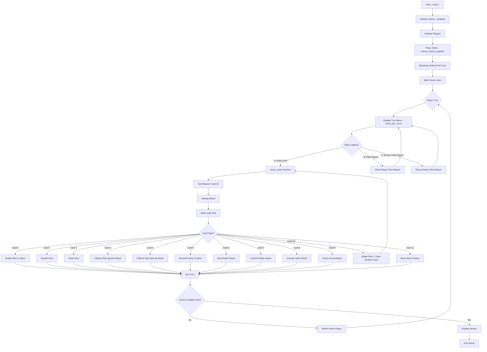

```mermaid
flowchart TD
    A[Start - main.c] --> B["Initialize Game - partida()"]
    B --> C[Initialize Players]
    C --> D[Place Ships - colocar_barcos_jugador]
    D --> E[Randomly Select First Turn]
    
    E --> F[Main Game Loop]
    
    F --> G{Player Turn}
    G --> H[Display Turn Menu - menu_por_turno]
    
    H --> I{Menu Options}
    I -->|A: Draw Card| J[sacar_carta Function]
    I -->|B: Fleet Report| K[Show Player Fleet Report]
    I -->|C: Enemy Fleet Report| L[Show Enemy Fleet Report]
    
    K --> H
    L --> H
    
    J --> M[Get Random Card ID]
    M --> N[Display Board]
    N --> O[Show Card Info]
    
    O --> P{Card Type?}
    
    P -->|Card 0| Q0[Single Shot or Salvo]
    P -->|Card 1| Q1[Double Shot]
    P -->|Card 2| Q2[Triple Shot]
    P -->|Card 3| Q3[4-Block Ship Special Attack]
    P -->|Card 4| Q4[5-Block Ship Special Attack]
    P -->|Card 5| Q5[Reveal Enemy Position]
    P -->|Card 6| Q6[Row Radar Attack]
    P -->|Card 7| Q7[Column Radar Attack]
    P -->|Card 8| Q8[Activate Salvo Mode]
    P -->|Card 9| Q9[Tower Accumulation]
    P -->|Card 10| Q10[Single Shot + Draw Another Card]
    P -->|Card 11| Q11[Move Ship Position]
    
    Q10 --> J
    
    Q0 --> R[End Turn]
    Q1 --> R
    Q2 --> R
    Q3 --> R
    Q4 --> R
    Q5 --> R
    Q6 --> R
    Q7 --> R
    Q8 --> R
    Q9 --> R
    Q11 --> R
    
    R --> S{Victory Condition Met?}
    S -->|No| T[Switch Active Player]
    T --> G
    S -->|Yes| U[Display Winner]
    
    U --> V[End Game]
```